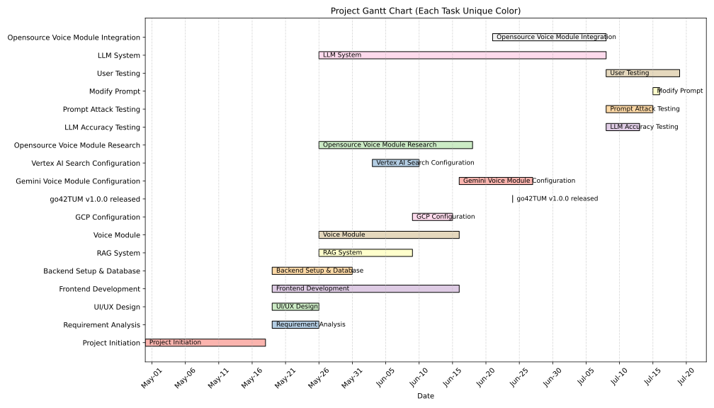

# 🗣️ **go42TUM Project Management Report**
> A Real-Time Voice AI Consultant for TUM Applicants

**Group:** 5   
**Live Demo:** [https://voice-assistant-gilt.vercel.app/](https://voice-assistant-gilt.vercel.app/)  
**GitHub Repository:** [https://github.com/tsaichen1o/voiceAssistant](https://github.com/tsaichen1o/voiceAssistant)

---
## 1. Project Vision
The vision of this project is to build an accessible, real-time voice-based assistant—go42TUM—that transforms how prospective students engage with the Technical University of Munich's (TUM) application process. Designed with inclusivity and practicality in mind, the system aspires to bridge the gap between complex administrative processes and human-friendly, multimodal interaction. By evaluating and integrating state-of-the-art open-source conversational AI models, the project seeks to uncover the real-world viability of self-hosted, voice-first AI agents in telephony and educational support domains.

Beyond technical benchmarking, our goal is to enable a human-equivalent conversational experience, where users—especially those with visual impairments—can simply speak their questions, hear meaningful answers, and feel confident navigating academic opportunities. The system doesn't just reply: it understands, remembers, adapts, and guides.

In the long term, we envision go42TUM as a scalable and vendor-neutral voice infrastructure that can be adopted beyond TUM, offering institutions a transparent, privacy-conscious alternative to commercial AI services. By focusing on modularity, real-time streaming, and adaptive dialogue, this project sets the foundation for the next generation of inclusive, intelligent, and open-access academic support agents.

## 2. Project Timeline & Milestones
The go42TUM project followed a structured 80-day development cycle from April 30 to July 18, using a waterfall-style Gantt plan to track task dependencies and key stages. The timeline emphasizes a progressive build-up of modular systems—starting from foundational setup to advanced integration and evaluation.

Key Phases:  
Phase 1: Planning & Design (May 1 – May 18)
The team initiated the project with requirement analysis and UI/UX design, laying the groundwork for development.

Phase 2: Core Development (May 18 – June 1)
Frontend and backend development ran in parallel with RAG system construction, voice module prototyping, and open-source voice research.

Phase 3: AI System Integration (June 1 – June 24)
This stage focused on integrating the LLM system, Vertex AI Search, and configuring Gemini.

Phase 4: Milestone Release – go42TUM v1.0.0 (June 24)
A key deliverable, this version marked the completion of all core features including voice/text interaction, real-time streaming, and database logging.

Phase 5: Open-Source Voice Module Integration (June 24 – July 7)
Following the milestone release, we focused on integrating and benchmarking three open-source voice pipelines.

Phase 6: Evaluation & Refinement (July 7 – July 18)
Accuracy testing, prompt robustness (attack testing), and user testing were conducted post-release to validate system behavior and identify areas for refinement.
## 3. System Architecture

## 4. Methodology & Approach

## 5. Team Roles & Responsibilities

## 6. Current Progress and Future Plans
### 6.1. Current Progress
We successfully integrated Gemini, via both API and Vertex AI, as the core reasoning engine. A prompt orchestration mechanism was developed to manage contextual interactions and enable coherent multi-turn conversations. Real-time text generation with partial streaming output was implemented to ensure low-latency, responsive user experiences.

A modular speech processing framework was designed using multiple open-source components to support flexible and extensible deployment. The ASR module utilizes Whisper with streaming compatibility, while the TTS pipeline incorporates SpeechBrain, Coqui TTS, and EdgeTTS. This architecture enables a complete text-to-voice and voice-to-text loop, facilitating natural, continuous spoken interaction.

We implemented a real-time multimodal integration pipeline combining speech-to-text, LLM processing, and text-to-speech synthesis. The system supports both voice and text interactions within a unified session framework, ensuring seamless cross-modal experiences. A basic web interface and a Redis-backed voice agent flow were developed to manage stateful interactions and support scalability.

A comprehensive performance evaluation framework was established, defining latency and responsiveness benchmarks under varying load conditions. Qualitative assessments of voice clarity, TTS expressiveness, and dialogue coherence were conducted to ensure intelligibility and naturalness of synthesized speech.

### 6.2. Identified Limitations
The system still has several limitations. First, open-source LLMs lack long-term dialogue memory, resulting in no persistent retention of user goals or interaction history across sessions. Second, current TTS systems exhibit limited prosodic variation, leading to flat emotional tone and robotic-sounding responses during extended conversations. Finally, real-world telephony testing remains limited; most evaluations have been conducted in controlled environments, with no full deployment in VoIP or Twilio-based pipelines under noisy, real-time conditions.

### 6.3. Future Work
Future work will focus on enhancing the naturalness, inclusivity, and continuity of voice-based interactions. First, we aim to develop a Voice Style Switcher that dynamically adjusts speech synthesis style based on semantic and contextual cues, while also allowing users to customize voice preferences for improved expressiveness. Second, Multilingual and Accent Adaptation will be explored to better support users with diverse linguistic backgrounds. Finally, we plan to implement a lightweight Voice Memory Storage and Context Migration mechanism to retain user intent, identity, and preferences across sessions—enabling features such as "continue last conversation" for more coherent and personalized dialogue experiences.

## Appendix
