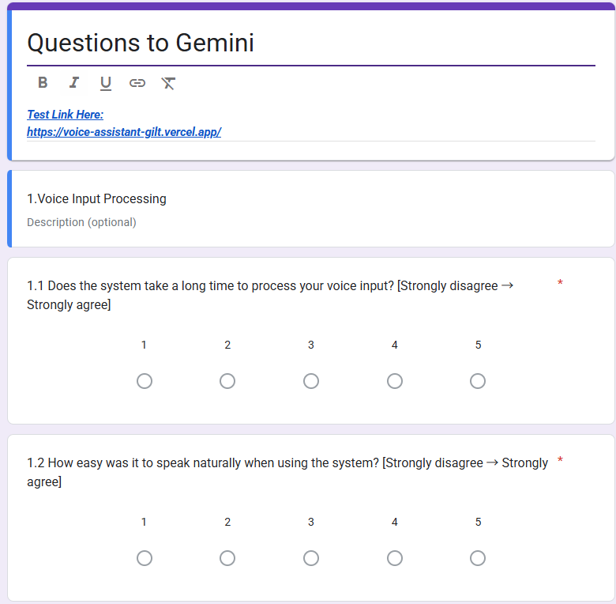
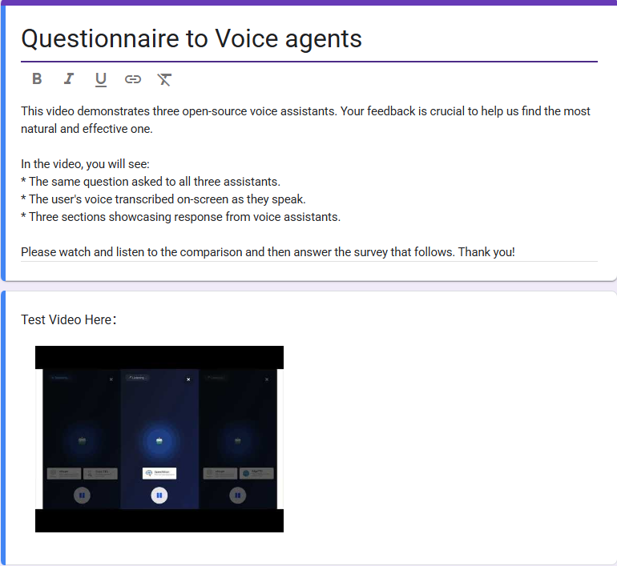
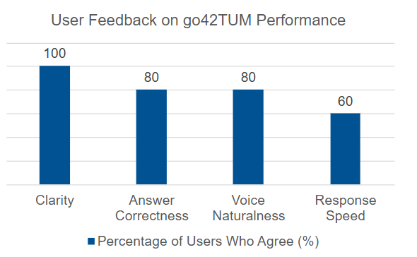
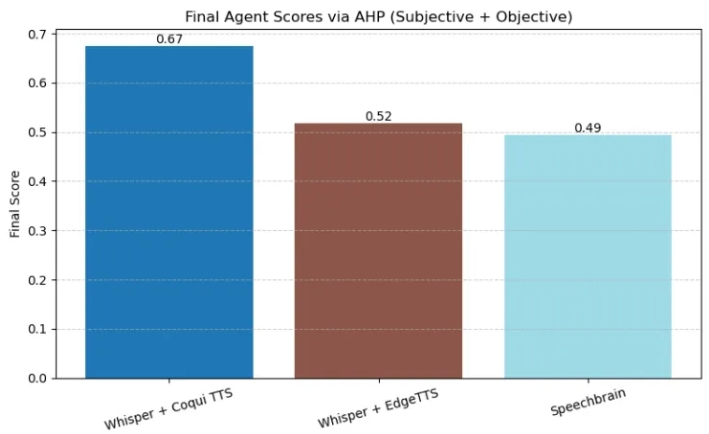

# User Acceptance Testing (UAT)

This chapter focuses on a comprehensive evaluation of the user acceptance of our AI voice assistant system. The system is powered by the Gemini large language model and incorporates three speech frameworks—SpeechBrain, Whisper + Coqui TTS, and Whisper + Edge TTS. It supports **English and German** voice input and is designed specifically for international students applying to TUM. To ensure scientific rigor and comprehensiveness, we designed two independent but complementary test branches: one evaluating the Gemini language model via online user feedback, and the other assessing the three speech frameworks through performance video demonstrations and multidimensional scoring analysis.

# Testing Objective

The main goals of this user acceptance testing are as follows:

- Evaluate Gemini’s language understanding and answer quality in both English and German contexts;
- Assess the speech recognition accuracy, speech synthesis quality, and response speed of the three speech frameworks in real interaction scenarios;
- Collect subjective user evaluations regarding overall system interaction experience;
- Use questionnaires and Analytic Hierarchy Process (AHP) combined with objective performance data to rank the three speech frameworks comprehensively;
- Verify the system’s adaptability and fault tolerance under the language constraints of supporting only English and German.

# Test Participants and Environment

- Twelve participants fluent in either English or German, with backgrounds related to applying to German universities, were recruited;
- Language distribution included 7 fluent English speakers and 5 fluent German speakers;
- Testing devices included desktop browsers and mobile browsers to ensure cross-platform compatibility;
- Testing environments included quiet indoor office settings and semi-open spaces such as cafes, simulating realistic usage scenarios;
- The system only supports English and German voice input; unsupported language inputs trigger friendly system prompts to avoid errors.

# User Testing Design and Implementation

The user testing was divided into two mutually independent modules to evaluate Gemini’s language model and the three speech frameworks separately.

## Branch A: Gemini Language Model Online Experience and Feedback

### Test Design

- Test users accessed the AI voice assistant platform powered by Gemini via a dedicated link, using real voice interaction to ask various questions related to TUM applications (supporting English and German);
- Users experienced the speech recognition, language understanding, and answer generation processes in real time;
- After the session, users completed a structured questionnaire based on a five-point Likert scale rating the following dimensions:
    - **Answer accuracy**: Whether the answers are correct and factual;
    - **Clarity of expression**: Whether the answers are fluent and easy to understand;
    - **Relevance**: Whether the answers address the key points of the questions;
    - **Practicality**: Whether the answers are helpful for the application process;
    - **Speech synthesis quality**: Whether the system’s voice replies are natural and fluent.

### Advantages and Significance

- Users can ask free-form questions covering a wide range of realistic scenarios, ensuring representative feedback;
- Real-time online interaction offers feedback that closely reflects actual user experience.

### Example Test Tasks

- English question example: “What is the application deadline for the TUM winter semester?”
- German question example: “Welche Dokumente benötigt man für die Bewerbung an der TUM?”

### Data Collection

- Aggregate user questionnaire scores and textual feedback;
- Collect behavioral data such as interaction duration, speech recognition error rate, and retry attempts.z

## Branch B: Three Speech Frameworks Video Demonstration + Questionnaire Feedback + AHP Multidimensional Evaluation

### Test Design

- For the three speech frameworks (SpeechBrain, Whisper + Coqui TTS, Whisper + Edge TTS), we produced standardized video demonstrations showcasing each framework’s performance in speech recognition accuracy, speech synthesis naturalness, and response speed;
- Test users watched the videos and subsequently completed separate questionnaires evaluating each framework’s speech recognition accuracy, speech synthesis naturalness, response speed, and overall user experience;
- Beyond subjective user ratings, we also incorporated **objective performance metrics** for each framework, mainly:
    - Speech recognition accuracy (ASR accuracy), based on experimental data statistics;
    - Response time, i.e., the latency from receiving user speech input to completing answer generation and playback.

### AHP Comprehensive Analysis Process

- Construct a multi-level indicator system combining questionnaire ratings and objective performance data;
- Build pairwise comparison matrices integrating user scores and objective data;
- Use Analytic Hierarchy Process (AHP) to compute weights of each criterion and composite scores for each framework;
- Validate consistency indices to ensure scientific reliability of results.

# Results Summary and Analysis

## **Gemini Language Model**

- Users showed high subjective satisfaction.
- Gemini excelled in answer accuracy and practicality, particularly receiving praise for clear answer structure and authoritative information;
- Users suggested further improving multi-turn dialogue capability and explanations of technical terms.

## Comprehensive Evaluation of Three Speech Frameworks

| Rank | Speech Framework    | Composite Score (via AHP)     |
| ---- | ------------------- | ----------------------------- |
| 1    | Whisper + Coqui TTS | Highest (approx. 0.67)        |
| 2    | Whisper + Edge TTS  | Second highest (approx. 0.52) |
| 3    | SpeechBrain         | Lowest (approx. 0.49)         |

   

- **Whisper + Coqui TTS** achieved the highest composite score (0.67), indicating strong performance across both subjective user feedback and objective evaluation metrics (accuracy and response time). Users particularly appreciated its speech naturalness and reliability.
- **Whisper + Edge TTS**, with a score of 0.52, ranked second. It showed balanced performance but was slightly less favored than Coqui in terms of voice quality, according to user ratings.
- **SpeechBrain** scored the lowest at 0.49, mainly due to relatively lower user satisfaction with speech synthesis fluency and higher response latency, despite having decent ASR accuracy.
- The results demonstrate that **combining subjective (questionnaire-based) and objective (performance-based) criteria via AHP** provides a well-rounded and quantifiable framework for evaluating speech frameworks in real-world applications.

# User Feedback Summary and Suggestions for Improvement

- **Positive feedback**:
    - Generally satisfied with the answers
    - It’s quite fast
    - It recognized quite well the voice
- **Negative feedback**:
    - Not so much informations
    - The system cannot understand what I am talking if I talk not in English or German
    - The system stops responding after a long conversation.
- **Improvement suggestions**:
    - Enrich answer content to provide more detailed and informative responses.
    - Add a friendly reminder or fallback when users speak in unsupported languages (non-English/German).
    - Improve system robustness during long conversations to prevent freezing or unresponsiveness.
    - Introduce user customization options such as speech rate and voice clarity settings.
    - Enhance conversational memory to better handle follow-up questions and maintain context.

# Summary

This user acceptance testing, through multidimensional evaluation and real user feedback, effectively verified the practical value of the Gemini language model in multilingual speech Q&A. Meanwhile, by integrating subjective questionnaire data with objective performance metrics using AHP, we scientifically revealed the relative performance of the three speech frameworks. The results indicate that Whisper + Edge is the most suitable speech framework for our system’s voice interaction needs. Future versions will focus on further optimizing system stability and user experience based on this foundation.