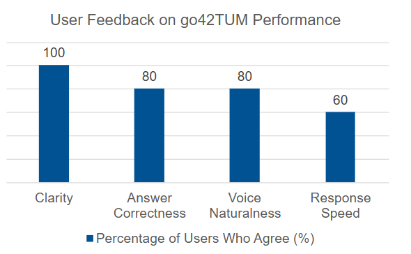
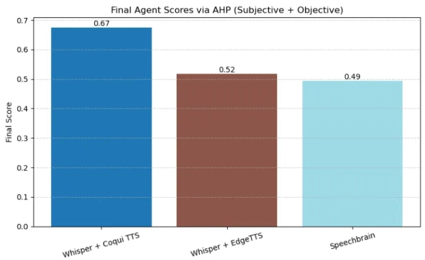

# **User Acceptance Testing**
> A Real-Time Voice AI Consultant for TUM Applicants

<strong>Group:</strong> 5   
<strong>Live Demo:</strong> <a href="https://voice-assistant-gilt.vercel.app/">https://voice-assistant-gilt.vercel.app/</a>  
<strong>GitHub Repository:</strong> <a href="https://github.com/tsaichen1o/voiceAssistant">https://github.com/tsaichen1o/voiceAssistant</a>

1. **[User Case Study](#user-case-study)**  
    [1.1 Process Overview](#process-overview)  
    [1.2 Advantages](#advantages)  
    [1.3 Limitations](#limitations)  
2. **[UAT Design and Execution](#uat-design-and-execution)**  
    [2.1 Gemini Evaluation (Live Interaction)](#gemini-evaluation-live-interaction)  
    [2.2 Speech Framework Evaluation (Video + Questionnaire)](#speech-framework-evaluation-video--questionnaire)  
3. **[Summary and Insights](#summary-and-insights)**  
    [3.1 Improvement Suggestions](#improvement-suggestions)  
    [3.2 Conclusion](#conclusion)  
**[Appendix](#appendix)**  
    [Figure A1: Gemini Feedback Bar Plot](#figure-a1-gemini-feedback-bar-plot)  
    [Figure A2: AHP Result Summary](#figure-a2-ahp-result-summary)  

 
\pagebreak 

This report presents a comprehensive evaluation of the user acceptance of our AI voice assistant system. The system is built on the Gemini large language model and integrates three different voice processing frameworks: **SpeechBrain**, **Whisper + Coqui TTS**, and **Whisper + Edge TTS**. It supports **English and German voice input only** and is tailored to assist international students applying to TUM.

To ensure structured and meaningful user engagement, the User Acceptance Testing (UAT) report was split into two complementary streams:
1. Real-time feedback on Gemini's performance in understanding and answering user queries;
2. Analytical evaluation of three speech processing frameworks through video demonstrations and multi-dimensional scoring.

---

## 1. User Case Study

**Participant Profile**  
The selected user, **Zhihong Wu**, is a 23-year-old prospective student from China preparing to apply to TUM for a Master’s program in Informatics. He is fluent in English and has intermediate German skills. He represents a typical international applicant who relies on online resources and voice assistants for navigating the complex university application process.

### 1.1 Process Overview

- Zhihong was first introduced to the purpose of the assistant and received a link to the Gemini-powered voice platform.
- He used the assistant to ask questions about TUM’s deadlines, required documents, and admission criteria in both English and German.
- Afterwards, he watched three short demo videos showcasing different speech frameworks (SpeechBrain, Whisper + Coqui, Whisper + Edge) handling the same input query.
- He completed two separate questionnaires: one for Gemini interaction, and one for speech framework evaluation.

### 1.2 Advantages

- Found the assistant easy to use and fast in processing  
- The bilingual capability was helpful for trying both English and German  
- Appreciated the clear pronunciation in the Whisper + Coqui output

### 1.3 Limitations

- Answers were sometimes too short and not sufficiently informative  
- When trying a few test phrases in Italian, the assistant failed to respond  
- Long interactions could cause the system to hang

For detailed user feedback metrics, please see [Figure A1: Gemini Feedback Bar Plot](#figure-a1-gemini-feedback-bar-plot) in the Appendix.

## 2. UAT Design and Execution

The UAT plan was designed to evaluate:

- The effectiveness of Gemini in answering application-related questions  
- The accuracy and smoothness of speech recognition and synthesis for both English and German  
- The comparative performance of the three voice processing frameworks  

### 2.1 Gemini Evaluation (Live Interaction) 

Participants were given a web link to interact directly with the AI voice assistant powered by Gemini. They were asked to speak English or German questions related to TUM applications, such as:

- “What is the deadline for TUM master’s application?”  
- “Welche Unterlagen brauche ich für die Bewerbung?”

After using the system, they filled out an online survey rating:

- Response accuracy  
- Language understanding  
- Interaction speed  
- Overall satisfaction  

**Sample User Feedback (Gemini):**
-  The answers are generally satisfying  
-  Recognition is fast and accurate  
-  Not much information given sometimes  
-  Doesn’t respond if language is not English or German

### 2.2 Speech Framework Evaluation (Video + Questionnaire)

To ensure consistency in input and eliminate bias caused by live variation, participants were shown pre-recorded videos demonstrating the performance of the three speech frameworks. Each video showed how the same query was processed via:

- **SpeechBrain**  
- **Whisper + Coqui TTS**  
- **Whisper + Edge TTS**

Participants completed a detailed questionnaire evaluating each framework based on:

- Voice recognition accuracy  
- Response latency  
- Naturalness of synthesized voice  
- Overall usability  

In addition to subjective ratings, we also included system-measured metrics:

- **ASR word error rate (WER)**  
- **Average response time per framework**

These subjective and objective factors were combined using the **Analytic Hierarchy Process (AHP)** to compute a final score and ranking. For the complete AHP analysis results, please see [Figure A2: AHP Result Summary](#figure-a2-ahp-result-summary) in the Appendix.

---
## 3. Summary and Insights

The UAT revealed several important insights:

- Gemini’s understanding and language handling were rated positively, though users wished for more detailed answers  
- Speech recognition worked well in both English and German, with minor latency noted in SpeechBrain  
- Whisper + Coqui TTS ranked highest overall in AHP analysis, balancing speed, clarity, and reliability  

### 3.1 Improvement Suggestions

- Expand the assistant’s answer base for more informative replies  
- Improve stability during longer sessions  
- Add prompts or fallback responses when unsupported languages are used  
- Consider multilingual expansion beyond English and German in future versions  

### 3.2 Conclusion
The UAT provided valuable user-centric insights into both the AI and speech components of the system. The testing plan not only validated our core functionalities but also surfaced actionable improvements. It demonstrated that the system is well-received by its target audience and ready for future iteration based on concrete feedback.

 
\pagebreak 

## Appendix

### Figure A1: Gemini Feedback Bar Plot

**Figure A1:** Bar plot visualization showing user feedback ratings for Gemini's performance across different evaluation criteria such as response accuracy and interaction speed.

### Figure A2: AHP Result Summary

**Figure A2:** Comprehensive AHP analysis results showing the final ranking and scoring of the three speech frameworks (SpeechBrain, Whisper + Coqui TTS, and Whisper + Edge TTS) based on combined subjective user ratings and objective performance metrics.

