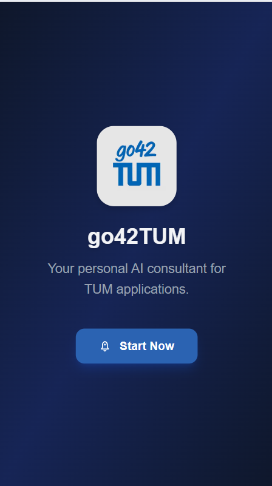
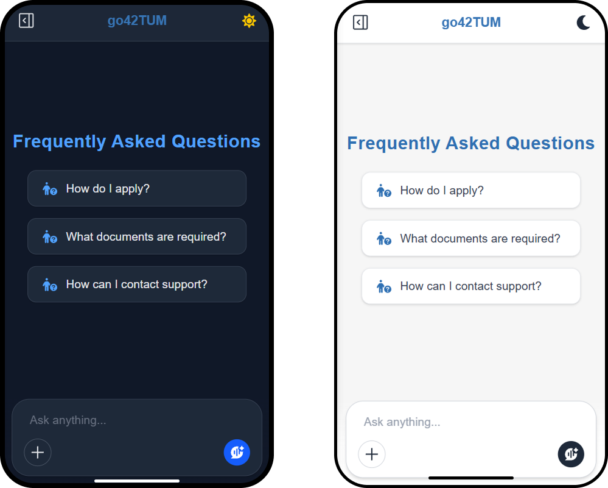
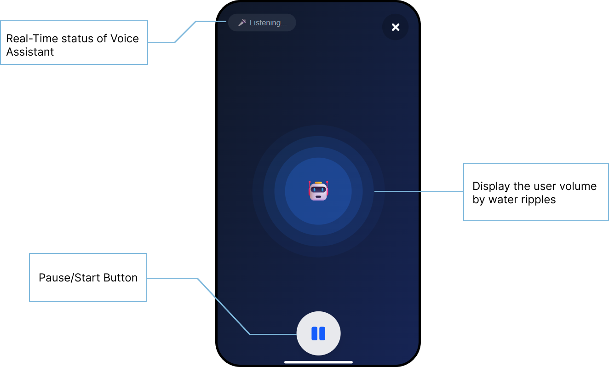
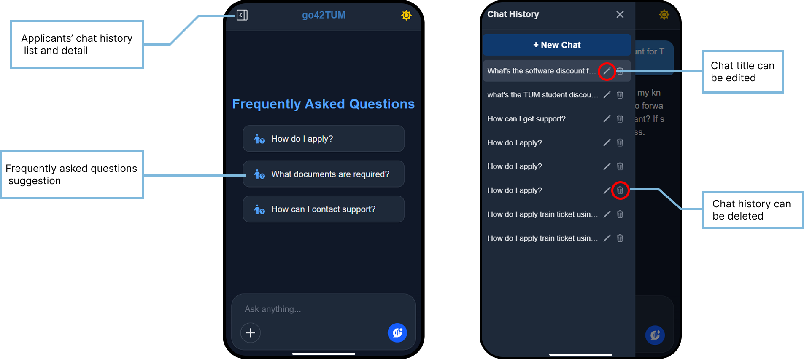
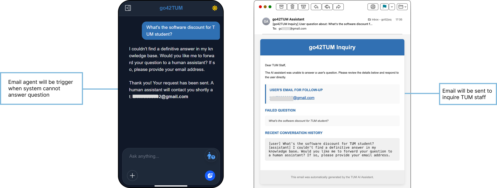

# **User Guide**
> A Real-Time Voice AI Consultant for TUM Applicants

<strong>Group:</strong> 5   
<strong>Live Demo:</strong> <a href="https://voice-assistant-gilt.vercel.app/">https://voice-assistant-gilt.vercel.app/</a>  
<strong>GitHub Repository:</strong> <a href="https://github.com/tsaichen1o/voiceAssistant">https://github.com/tsaichen1o/voiceAssistant</a>

1. **[Introduction](#introduction)**
2. **[Getting Started](#getting-started)**
3. **[Key Features](#key-features)**
4. **[FAQs & Troubleshooting](#faqs--troubleshooting)**

 
\pagebreak 

## 1. Introduction
**go42TUM** (pronounced "go-for-TUM") is an intelligent voice assistant specifically designed to help prospective students navigate TUM's application process. The name represents our mission to make it easier for everyone to "go for TUM" - to pursue their educational dreams at Technical University of Munich without barriers. **go42TUM** integrates voice-first interaction, real-time guidance, multilingual capabilities, and session tracking to enhance usability and streamline the application process.

### 1.1 Who is it for?

- **International students** who may face language or navigation barriers.
- **Visually impaired users** or those with accessibility needs, benefiting from the voice-first design.
- **Busy individuals** looking for quick, accurate guidance without digging through multiple web pages.

### 1.2 How does it work?

1. The user types or speaks a question related to the TUM application process—such as admission deadlines, required documents, or program requirements.
2. The system analyzes the query and retrieves relevant information using **Vertex AI Search**, ensuring responses are accurate and up-to-date.
3. The response is delivered to the user in both **text and audio formats**, supporting different accessibility needs and usage preferences.
4. If the system cannot confidently answer a question, it automatically triggers the **email agent**, allowing the user to send a follow-up inquiry directly to the TUM support team—ensuring no question goes unanswered.

## 2. Getting Started

### 2.1 System Requirements
1. Recommended browsers: Chrome or Edge.
2. Stable internet connection required.
3. Must support microphone access for voice features.

### 2.2 Accessing the Applicatio

1. Open the application and log in using email.
2. Login success leads you directly to the app’s main interface.

### 2.3 UI Overview

1. **Chat History/Navigation Panel (Left Sidebar):** This panel displays "Chat History" and lists past conversations. The "+ New Chat" button allows users to initiate a new conversation. This functions as the primary navigation area.
2. **Frequently Asked Questions (Main Content Area):** This section presents common queries, providing quick access to information. The visible questions are:
    - "How do I apply?"
    - "What documents are required?"
    - "How can I contact support?"
3. **Chat Input Area (Bottom Bar):** This area, labeled "Ask anything...", allows users to type in their questions or requests. The icon on the far right (resemblg a chat bubble with a person) is for sending the message or accessing chat-related settings.

4. **Evening Modine / Morning Mode Toggle:** This feature allows users to switch between light (morning) and dark (evening) themes for better visual comfort depending on the time of day or user preference. The toggle is usually represented by a sun 🌞 or moon 🌙 icon and ensures accessibility and reduced eye strain during prolonged usage.

## 3. Key Features

### 3.1 Voice-First Interaction

Natural voice conversations with real-time audio processing and intelligent interruption detection, enabling a smooth and human-like interaction. The system supports both speech-to-text and text-to-speech, making it highly accessible for visually impaired users or those on the go.

### 3.2 Instant Application Guidancee

The system provides real-time answers to TUM application-related questions by retrieving the most relevant and up-to-date information from trusted sources, significantly reducing the time and effort required to search through multiple web pages. It covers key topics such as deadlines, required documents, and admission procedures.

### 3.3 AI-Powered Response Generation

Powered by Gemini and Vertex AI Search, the system generates accurate and context-aware responses based on user queries and retrieved information. It understands natural language input, supports follow-up questions, and adapts to the conversation flow to deliver personalized, coherent answers.

### 3.4 Smart FAQ System

Dynamic suggestions and clickable FAQ items for common questions. The system learns from user interactions and frequently asked queries to improve recommendations over time, making information discovery even faster and more intuitive.

### 3.5 Chat History Storage

Provides users with persistent chat history and context-aware conversations. Users can revisit previous interactions at any time, track the progression of their queries, and pick up seamlessly from where they left off. The system intelligently maintains session context, enabling more natural follow-up questions without the need to rephrase or repeat earlier input. This continuity not only saves time but also enhances the overall user experience by making the conversation feel more fluid, personalized, and human-like.

### 3.5 Email Agent

When the system encounters questions beyond its current knowledge base, the email agent is triggered to ensure seamless support continuity. It intelligently analyzes the user's query and auto-generates a well-structured, polite, and context-rich email draft addressed to the appropriate TUM department or contact point. Users can review, customize, or directly send the message with minimal effort, eliminating the need to search for email addresses or write formal inquiries themselves. This feature ensures that even the most complex or uncommon questions are routed to the right human experts—guaranteeing that no user concern goes unresolved and providing a safety net beyond automated responses.

## 4. FAQS & Troubleshooting

### 4.1 Best Practice

To ensure an optimal user experience and maximize the value of the voice-based TUM assistant, the following best practices are recommended:

#### 1. Start with Specific, Goal-Oriented Queries
Instead of vague questions like “Tell me about TUM,” users are encouraged to ask focused questions such as “What are the English language requirements for the Information Engineering program?” This helps the system retrieve more accurate and relevant information.

#### 2. Use Voice Interaction in Hands-Free or Accessibility Scenarios
Leverage the voice-first feature when multitasking, on mobile, or in accessibility-sensitive environments (e.g., visually impaired users), to enjoy a seamless and responsive conversation flow.

#### 3. Review Chat History for Consistency
Users can revisit past questions using the persistent chat history. This prevents repeated queries, and helps track prior responses for cross-referencing.

#### 4. Escalate via Email Agent When Needed
If the system cannot answer a complex or administrative-specific question (e.g., “How to submit a late transcript due to visa delay?”), users should make use of the built-in email agent to connect directly with TUM staff. The system will generate a professional draft that can be sent with just a few edits.

#### 5. Provide Feedback for Continuous Improvement
When users find outdated, unclear, or missing information, submitting brief feedback allows our development team to refine retrieval quality and update the FAQ system for future users.

### 4.2 Common Issues & Solutions

| **Issue**                     | **Recommended Solution**                                                                                                                              |
| ----------------------------- | ----------------------------------------------------------------------------------------------------------------------------------------------------- |
| **No Voice Response**         | Clear your browser cache and reopen the app. This resolves most temporary glitches.                                                                   |
| **Fails to Connect**          | Switch to a different network or check your firewall settings. University or corporate networks (e.g., *eduroam*) may block required API connections. |
| **Email Agent Not Triggered** | Ensure the input contains **only** a properly formatted email address — no extra characters, spaces, or messages.                                     |

