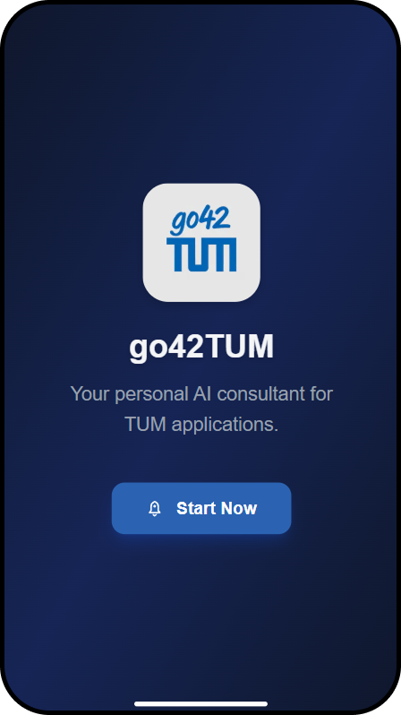

# **User Guide**
> A Real-Time Voice AI Consultant for TUM Applicants

<strong>Group:</strong> 5   
<strong>Live Demo:</strong> <a href="https://voice-assistant-gilt.vercel.app/">https://voice-assistant-gilt.vercel.app/</a>  
<strong>GitHub Repository:</strong> <a href="https://github.com/tsaichen1o/voiceAssistant">https://github.com/tsaichen1o/voiceAssistant</a>

1. **[Introduction](#introduction)**
2. **[Getting Started](#getting-started)**
3. **[Key Features](#key-features)**
4. **[FAQs & Troubleshooting](#faqs--troubleshooting)**

 
\pagebreak 

## 1. Introduction
**go42TUM** (pronounced "go-for-TUM") is an intelligent voice assistant specifically designed to help prospective students navigate TUM's application process. The name represents our mission to make it easier for everyone to "go for TUM" - to pursue their educational dreams at Technical University of Munich without barriers. **go42TUM** integrates voice-first interaction, real-time guidance, multilingual capabilities, and session tracking to enhance usability and streamline the application process.

👥**Who is it for?** 

- Prospective TUM applicants

📱**How does it work?**

User type in or speak to tum application related problems.

1. The user types or speaks a question related to the TUM application process.
2. The system analyzes the query and retrieves relevant information using Vertex AI Search.
3. Gemini generates an enhanced response based on both the user's input and the retrieved results.
4. The user receives a response in text or audio format.

## 2. Getting Started
💻 **System Requirements**

1. Recommended browsers: Chrome or Edge.
2. Stable internet connection required.
3. Must support microphone access for voice features.

🔗 Accessing the Application

1. Open the application and log in using email.
2. Login success leads you directly to the app’s main interface.

📊 UI Overview

1. **Chat History/Navigation Panel (Left Sidebar):** This panel displays "Chat History" and lists past conversations. The "+ New Chat" button allows users to initiate a new conversation. This functions as the primary navigation area.
2. **Frequently Asked Questions (Main Content Area):** This section presents common queries, providing quick access to information. The visible questions are:
    - "How do I apply?"
    - "What documents are required?"
    - "How can I contact support?"
    
    These questions directly link to predefined answers or initiate a chat flow related to these topics.
    
3. **Chat Input Area (Bottom Bar):** This area, labeled "Ask anything...", allows users to type in their questions or requests. The icon on the far right (resembling a chat bubble with a person) is for sending the message or accessing chat-related settings.

4. **Evening Mode / Morning Mode Toggle:** This feature allows users to switch between light (morning) and dark (evening) themes for better visual comfort depending on the time of day or user preference. The toggle is usually represented by a sun 🌞 or moon 🌙 icon and ensures accessibility and reduced eye strain during prolonged usage.

## 3. Key Features

🔊 **Voice-First Interaction**

Natural voice conversations with real-time audio processing and intelligent interruption detection.

⚡ **Instant Application Guidance**

The system provides real-time answers to TUM application-related questions by retrieving the most relevant and up-to-date information from trusted sources.

🧠 **AI-Powered Response Generation**

Powered by Gemini and Vertex AI Search, the system generates accurate and context-aware responses based on user queries and retrieved information.

🧐**Smart FAQ System**

Dynamic suggestions and clickable FAQ items for common questions.

📑**Chat History Storage**

Provide users with persistent chat history and context-aware conversations.

📩**Email Agent**

When the system encounters questions beyond its knowledge base, this agent will intelligently compose and send emails to relevant TUM staff members.

## 4. FAQS & Troubleshooting

### 🛠️ Common Issues & Solutions

| **Issue**                       | **Recommended Solution**                                                                                                                              |
| ------------------------------- | ----------------------------------------------------------------------------------------------------------------------------------------------------- |
| 🔇 **No Voice Response**         | Clear your browser cache and reopen the app. This resolves most temporary glitches.                                                                   |
| 🌐 **Fails to Connect**          | Switch to a different network or check your firewall settings. University or corporate networks (e.g., *eduroam*) may block required API connections. |
| 📧 **Email Agent Not Triggered** | Ensure the input contains **only** a properly formatted email address — no extra characters, spaces, or messages.                                     |

