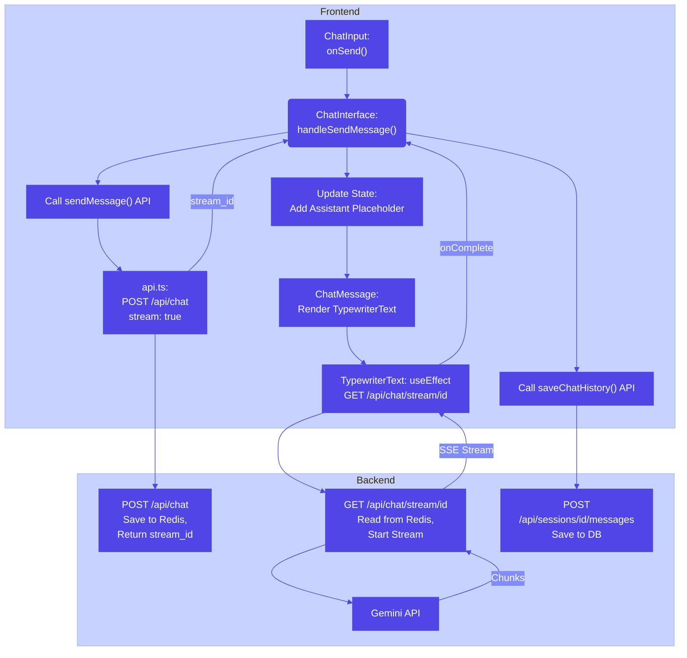

# 🗣️ TUM Application Assistant (Frontend)

This is the frontend of the **TUM Application Assistant**, a Progressive Web App (PWA) that helps prospective students explore TUM study programs, additionally, using voice interaction. The app is mobile-first and designed to be accessible, including for visually impaired users.

🌐 **Live site**:  
👉 [https://voice-assistant-gilt.vercel.app/](https://voice-assistant-gilt.vercel.app/)

---

## 🚀 Features

### Core Features
- ✅ **Voice Input**
  - Web Speech API integration
  - Real-time volume visualization
  - Animated overlay with pause/resume controls
  - Voice input button in chat interface
- ✅ **Chat Interface**
  - Real-time message streaming
  - Typewriter effect for assistant responses
  - Markdown support for rich text formatting
  - Auto-scroll to bottom with manual override
  - Message history persistence
  - Dark/Light mode support
- ✅ **Multi-language Support**
  - English and Chinese (Traditional) support
  - i18n integration with JSON backend
  - Automatic language detection
  - Language persistence
- ✅ **File Upload**
  - Image preview support
  - Multiple file selection
  - Preview removal capability
  - Drag and drop support

### UI/UX Features
- ✅ **Responsive Design**
  - Mobile-first approach
  - Adaptive layout for all screen sizes
  - Touch-friendly interface
- ✅ **Accessibility**
  - High contrast mode support
  - Screen reader compatibility
  - Keyboard navigation
  - Focus management
- ✅ **Theme Support**
  - Dark/Light mode toggle
  - System preference detection
  - Theme persistence
- ✅ **FAQ System**
  - Dynamic FAQ suggestions
  - Clickable FAQ items
  - Multi-language FAQ support
  - FAQ modal for quick access

### Technical Features
- ✅ **PWA Support**
  - Installable on mobile devices
  - Offline capability
  - Service worker integration
- ✅ **State Management**
  - React Context for global state
  - Local storage for persistence
  - Session management
- ✅ **API Integration**
  - RESTful API communication
  - WebSocket/SSE for real-time updates
  - Error handling and retry logic
- ✅ **Performance**
  - Code splitting
  - Lazy loading
  - Optimized assets
  - Caching strategies

---

## 🛠️ Getting Started (Local Development)

### 1. Clone the repository

```bash
git clone https://github.com/tsaichen1o/voiceAssistant.git
cd frontend
```

### 2. Install dependencies

```bash
yarn install
```

### 3. Start the development server

```bash
yarn dev
```

Visit `http://localhost:3000` in your browser.

---

## 🧱 Built With

* [Next.js 15](https://nextjs.org/)
* [Tailwind CSS](https://tailwindcss.com/)
* [react-i18next](https://react.i18next.com/) + [i18next-http-backend](https://github.com/i18next/i18next-http-backend)
* [next-pwa](https://github.com/shadowwalker/next-pwa)
* [Web Speech API](https://developer.mozilla.org/en-US/docs/Web/API/Web_Speech_API)
* [uuid](https://www.npmjs.com/package/uuid)
* [React Icons](https://react-icons.github.io/react-icons/)
* [React Markdown](https://github.com/remarkjs/react-markdown)

---

## 📁 Project Structure

```
frontend
├── src
│   ├── app
│   │   ├── layout.tsx
│   │   ├── page.tsx     # Landing page
│   │   ├── login
│   │   │   └── page.tsx
│   │   └── chat
│   │       ├── layout.tsx
│   │       └── [userId]
│   │           └── [chatSessionId]
│   │               └── page.tsx
│   ├── components
│   │   ├── LandingPage.tsx
│   │   ├── ChatSidebar.tsx
│   │   ├── ChatInterface.tsx
│   │   ├── ChatInput.tsx
│   │   ├── ChatMessagesList.tsx
│   │   ├── ChatMessage.tsx
│   │   ├── TypewriterText.tsx
│   │   └── VoiceAssistantOverlay.tsx
│   ├── services
│   │   └── api.ts
│   ├── context
│   │   └── ChatContext.tsx
│   ├── hooks
│   │   └── useMicrophoneVolume.ts
│   ├── types
│   │   └── chat.ts
│   ├── libs
│   │   └── utils.ts
│   ├── i18n.ts
│   └── styles
│       └── globals.css
├── public
│   ├── locales
│   │   ├── en
│   │   │   └── translation.json
│   │   └── zh
│   │       └── translation.json
│   ├── logo.png
│   └── icons/
├── next.config.ts
├── tailwind.config.js
├── postcss.config.mjs
├── tsconfig.json
└── package.json
```

---

## 📦 Deployment

The project is deployed on **Vercel**. You can easily deploy it by connecting your GitHub repo to Vercel and setting the **root directory** to `frontend/`.

---

## 🌍 Multi-language (i18n)
- All UI strings and FAQ content are managed via JSON files in `public/locales/{lang}/translation.json`
- Language switching is supported via i18next
- Automatic language detection based on browser settings
- Language preference persistence in localStorage

---

## 💡 Notable UI/UX Features
- **FAQ Suggestions**: When chat is empty, clickable FAQ suggestions are shown (auto-translated)
- **Voice Overlay**: Animated, volume-reactive overlay for voice input, with pause/close controls
- **Typewriter Effect**: Assistant replies are animated character-by-character
- **Scroll to Bottom**: Button appears when chat is not at the bottom
- **Responsive Design**: Works great on mobile and desktop
- **Dark/Light Mode**: System preference detection with manual override
- **File Upload**: Image preview with drag-and-drop support

---

## 📝 License
MIT

### Appendix

#### Chat Message Flow Architecture
